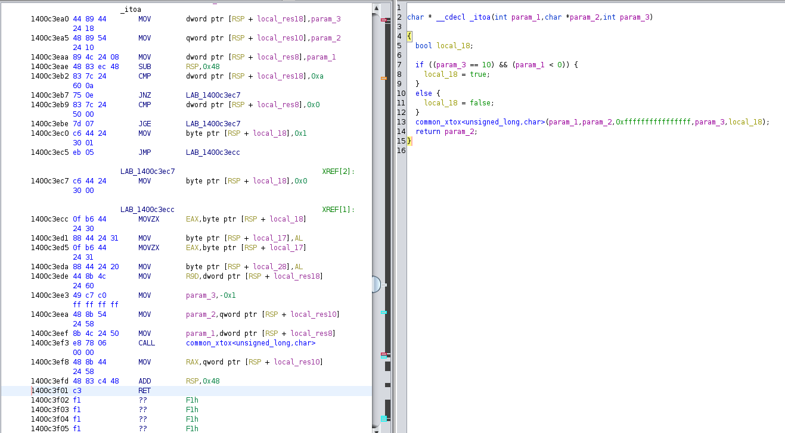
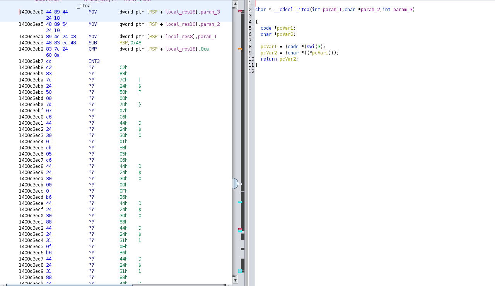

# Nanomites

As an optional feature in the Theia packer, you can enable _nanomites_ in your binary to increase protection against dumping attacks. When enabling nanomites, the Theia packer will automatically replace certain instructions in your binary with an opaque call to the runtime instead. In particular, the first [conditional jumps instruction](https://www.felixcloutier.com/x86/jcc.html) of eligible functions will be replaced with an instruction that triggers an exception, such that the Theia runtime can handle it.

**Why nanomites?**  
Nanomites make it significantly harder for an attacker to create a standalone version of your application with Theia removed. This is because even decrypted code will still require the Theia runtime to properly dispatch the instructions that have been replaced.

Additionally, nanomites make it significantly harder for an attacker to statically reverse engineer your application, because it becomes very difficult for an attacker to determine what type of conditional branch was intended. Consider the following disassembly and decompilation, generated by [Ghidra](https://ghidra-sre.org/), a tool often used by attackers to determine what your code does:

When nanomites are turned on, the exact same code now shows as follows:

Note that it becomes impossible to decompile the function, and that certain instructions are disassembled incorrectly.

**Performance costs of nanomites**  
Nanomites impose a significant runtime cost on your application. This is because the runtime must be invoked on a large amount of conditional branches done by your application. Additionally, the CPU becomes unable to perform branch prediction on the obfuscated branches, causing a pipeline stall which negatively affects performance.

To alleviate this issue, the Theia runtime will keep track of the amount of times each nanomite is triggered during execution. If it detects that a certain nanomite is "hot" (i.e. called often), it will automatically restore the nanomite back to the original instruction that it replaced. This will restore the performance of the function back to normal.

As a guideline, we observe the following framerates on the UE4 ShooterGame example. These numbers are not rigorously benchmarked, and should instead serve as a guideline for the relative performance impact of nanomites. All numbers are averaged over a 1:30 recorded gameplay demo, and include the process of loading the map.

| **Mode**                       | **Avg. FPS** | **1% low FPS** |
|--------------------------------|--------------|----------------|
| No Nanomites                   |          162 |             99 |
| Nanomites (restoring disabled) |           12 |              1 |
| Nanomites (restoring enabled)  |          156 |            47† |

†: The 1% low FPS for nanomites is impacted by the initial few frames, when hot nanomites inside the rendering loop have not yet been restored. Over a longer time, we expect these lows to converge to a similar low as with nanomites disabled.

**Configuring nanomites**  
The [module configuration](../configs/module-config.md) allows you to configure the behavior for nanomites in a single module, including the thresholds needed for the runtime to restore hot nanomites.
