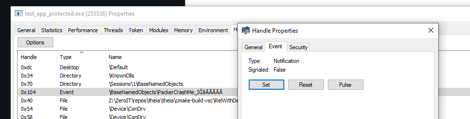

# Diagnosing user issues

Users of your application will inevitably encounter issues. When these issues are related to Theia, we are happy to work together with you to diagnose and resolve them.

This document outlines the various different types of crashes and issues your users might encounter in production, and will help you diagnose the general cause of crashes. Please take time to read through this document as it will help resolve any issues faster by making sure that only relevant issues are reported and that we have actionable information to diagnose their causes.

## Issue classes

When integrating Theia into your application or game, you may encounter various issues categorized into four overarching categories:

### Application Issues

These issues are present in both the protected and unprotected versions of your application, although Theia may increase their occurrence.

- Typically discovered during development and QA but may also appear in production.
- Diagnosis is possible through standard processes by loading the original PDB into a Theia-produced minidump.
- We generally cannot help with resolving these issues, as we have no access to your application source.

Examples of application issues that are more likely to occur in protected builds are:

- Bugs that are caused by race conditions or implicit reliance on initialization order
- Undefined behaviour present in the application, such as the use of uninitialized variables
- Code that relies on a specific binary layout.

### Integration Issues

Integration issues arise from incompatibilities between your application or its dependencies and the selected Theia features.

- These issues are usually identified during the initial integration phase in development or QA.
- We recommend reviewing the documentation for each enabled Theia feature to understand potential incompatibilities and caveats.
- Root causes can often be identified by systematically disabling Theia features until the issue resolves.

Examples of integration issues include:

- Attempting to read code bytes at runtime (e.g. hooking libraries, call-stack validation logic).
- Use of raw assembly or other features that place data inside executable code sections (e.g. jump tables).
- Using anti-cheat or integrity software such as Easy Anti-Cheat without the appropriate [compatibility settings](./incompatibilities.md).

### Theia Issues

These issues are caused by the Theia runtime. These include asserts/crashes inside the runtime, or incompatibilities with third-party software installed on the end user's PC.

- The Theia [diagnoser](../components/diagnoser.md) CLI tool can be used to obtain additional crash information, which can help point to the root cause of the crash.
- In the case of direct crashes or incompatibilities with common third-party software, the Zero IT team strives to resolve these issues as fast as possible.

Examples of Theia issues include:

- Assertions failing inside the Theia runtime.
  - Exceptions to these are calls failing due to resource exhaustion, e.g. asserts with statuses such as `ERROR_NOT_ENOUGH_MEMORY`, `STATUS_COMMITMENT_LIMIT`.
- Detections producing false positive results.

### Invalid/Intentional Issues

These issues include all crashes that are either intentional (e.g. a crash when a debugger is detected), or caused because the computer is overloaded or malfunctioning.

- Generally only happen in production and only in very small quantities. Crashes are often completely unique even on large user bases.
- Can be identified because crashes are either nonsensical (e.g. `STATUS_ACCESS_VIOLATION` on an instruction that does not access memory), or the information given by the [diagnoser](../components/diagnoser.md) tool clearly indicates that the crash was intentional or unavoidable (e.g. an assert triggered with status `ERROR_NOT_ENOUGH_MEMORY`).

Examples of invalid or intentional crashes include:

- Minidump files that are partially or entirely corrupted.
- A Theia-induced crash with crash code `Periodic::Corruption`, indicating that essential periodic data structures were corrupted.
- A Theia-induced crash with crash code category `HardwareError`, indicating that the hardware behaves inconsistently.
- Other hardware errors which are not caught and reported the earlier crash code category.
- An assertion failure inside the Theia runtime with status code `ERROR_NOT_ENOUGH_MEMORY`, indicating that the computer was under heavy load and unable to provide required resources.

If you encounter a lot of hardware issue dumps, consider turning on the hardware error message feature in the [runtime configuration](../configs/runtime-config.md). When enabled, this feature will notify the user and exit the process, without producing a dump.

## Materials for diagnosing and resolving crashes

If you are unable to diagnose a crash, or if a crash is caused by Theia, we are happy to help. Depending on the nature of the issue, we may require additional resources from your end to properly diagnose and resolve the issue. This section lists various resources that we can possibly ask for, and that we hope you are able to provide when needed.

### Minidumps

Minidumps serve as the primary method for processing crash reports, offering a concise snapshot of the error and its immediate context. While they are usually sufficient for identifying the issue at hand, they often lack the depth needed to diagnose the complete sequence of events leading to the crash.

We strongly recommend that you automatically collect minidumps when a user crashes in production. If using the Theia dumper, the [`http`](../configs/runtime-config.md) setting can be used to automatically upload captured dumps to an HTTP(S) endpoint of your choosing. Alternatively, a service such as Sentry or Bugsnag can also be used as a method for ingesting crashes.

We expect you to review minidumps internally first to determine the [type of the crash](#issue-classes) and to properly determine the rate at which this specific issue occurs. In practice, we have observed that the vast majority of crashes contained in a minidump are either hardware issues (see [invalid/intentional issues](#invalidintentional-issues)) or [application issues](#application-issues).

For [integration](#integration-issues) and [Theia](#theia-issues) issues, minidumps generally do not contain enough information for us to completely diagnose the problem. If you encounter such an issue, we ask that you obtain a [full dump](#full-dumps) (using the Theia dumper, full dumps can be created by holding shift while pressing "Create Dump"). If obtaining full dumps after the fact is hard to do, you may want to consider asking for a full dump in all support conversations to preemptively collect this information.

### Full dumps

Full dumps are dump files that contain the entire context of the process, including a capture of all process memory and the full state of all threads. They are effectively a complete snapshot of the state of the process at the time of crashing, which makes them significantly more useful when determining the root cause of any particular issue.

Since full dumps are much larger than minidumps, we recommend only gathering these when needed. With the Theia dumper, holding shift while pressing the "Create Dump" button will produce a full dump. Alternatively, the Theia dumper can be [configured](../configs/runtime-config.md) to always produce a full dump.

When reporting an issue to Zero IT Lab, it is highly desirable that you attach a full dump whenever possible. If the issue is encountered during dev/QA, this is generally trivial (and we recommend that QA be instructed to create full dumps whenever they encounter a crash). Full dumps will aid us significantly in diagnosing the issue.

We understand that obtaining a full dump for an issue encountered by arbitrary players in production is significantly harder. In these cases, feel free to reach out with the initial minidump but keep in mind that it may not contain enough information to act upon. In some cases, especially if an issue is encountered by a large number of players, it may also help if you are able to provide several unique minidumps exhibiting the same issue.

### Minimum reproducibles

Minimum reproducibles are the smallest possible application and/or configuration that still exhibits a given issue. They are generally useful for diagnosing [integration](#integration-issues) and third-party software [incompatibility](#theia-issues) issues, and allow us to independently reproduce issues without the need for a (mini)dump file.

If you encounter an issue in Theia that you are able to narrow down to a small source snippet or compiled application, minimum reproducibles are often the preferred method of sharing it with us. Minimal reproductions allow us to locally reproduce the issue, debug the process, and confirm a potential solution without the need for you to share your complete application with us.

Minimal reproductions are also useful when dealing with issues that are not directly related to a crash. As an hypothetical example, you may observe that a library is significantly slower when running under Theia. In that case, a minimum reproducible consisting of just the library and the code needed to invoke it is likely enough for us to help diagnose the issue.

When providing us with a minimum reproducible, please also include the module and runtime configuration associated with the reproducible. If the issue only manifests when paired with a specific software or OS version, please also include full information on the relevant software (i.e. software name, version, relevant software settings).

### Full unprotected executable and PDB

In very rare occurrences, we may need to ask you for a fully unprotected executable and asssociated PDB file in order to debug issues. We generally will only ask this for tricky [integration](#integration-issues) issues whose cause you are unable to directly isolate (if you are able to isolate the cause, we highly prefer receiving a [minimum reproducible](#minimum-reproducibles)). Depending on the nature of the crash, we may also need the associated assets (e.g. cooked game assets) needed to run the provided executable.

In the case that we need a full executable and PDB, we will store this information securely and only retain it for the duration of the issue.

## Crash diagnosing flowchart

Based on our experience with our existing partners, we have produced a flowchart to help guide you through the steps of diagnosing user issues that manifest as crashes. While it is impossible to cover all scenarios comprehensively, the large majority of issues encountered in the wild fit in one of the paths pictured. This flowchart makes use of the terminology introduced earlier in this document.

If anything is unclear, if you are unable to deduce the reason of a crash, or if you are not sure what resources are needed for us to help diagnose a crash, please feel free to reach out.

_For a higher resolution version, [click here](../assets/img/issue-diagnosing-flow.svg)._

## Diagnosing issues that don't result in crashes

You may encounter issues in production that don't manifest themselves as crashes, such as hangs or extremely degraded performance. Because no crash dump is produced, it becomes much harder to diagnose the exact cause of these issues.

We recommend tackling these issues in a similar manner to third-party software incompatibilities. Begin by attempting to isolate the specific factors that cause the issue (e.g. a specific code path is significantly slower while protected, a hanging issue only manifests on certain Windows versions, etc). If possible, use this information to create a [minimum reproducible](#minimum-reproducibles) that exhibits the same problematic behaviour.

If your application encounters a hanging issue, it is possible to force an immediate crash through an [event object](https://learn.microsoft.com/en-us/windows/win32/sync/event-objects) exposed by Theia. For each process, Theia creates an event object named `/BaseNamedObjects/PackerCrashMe_XXX`. Signaling this event will immediately cause the process to raise an error, opening the Theia crash dumper if configured. This can be used to create a [(full) dump](#full-dumps) of the process, which may help diagnose the cause of the hang. You can trigger the event using [System Informer](https://systeminformer.sourceforge.io/) by navigating to the hanging process, opening properties, handles, finding the `PackerCrashMe` handle, and using the `Set` button inside its properties:

We are happy to help the diagnosing process of non-crashing issues. However, we ask that you provide either a minimum reproducible (if possible), or some way of running your software in a manner that exhibits the problem. Crash dumps alone are generally not enough to reproduce these issues.
